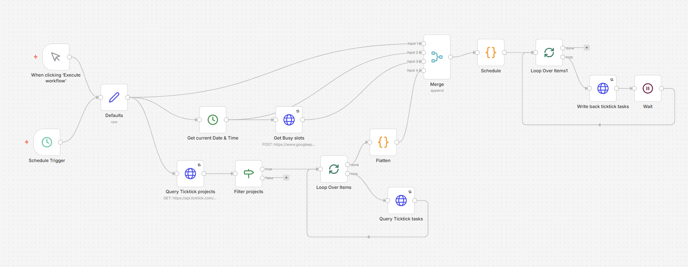

# n8n TickTick Autoscheduler



An [n8n](https://n8n.io/) workflow that automatically reshuffles your [TickTick](https://ticktick.com/) tasks into the free time slots of your Google Calendar — respecting your weekly work hours, calendar busy events, task durations and a configurable buffer between tasks.

## Why this exists

Tools like [Motion](https://www.usemotion.com/), [Akiflow](https://akiflow.com/) and [Reclaim](https://reclaim.ai/) do clever automated task scheduling, but they cost $20–30/month and bring more complexity than I needed. TickTick already does 95% of what I want from a personal task manager — fast apps, reasonable web UI, recurring tasks, Pomodoro timer, native calendar sync — at a fraction of the price. The piece I missed was *"find a free slot for this task and put it there"*, which TickTick + Google Calendar can't do natively. This workflow fills that gap.

It's built on top of [n8n](https://n8n.io/), a visual workflow platform that runs equally well on n8n Cloud or a self-hosted instance. That means you don't have to be a developer to use this — once n8n is set up, the whole thing is point-and-click after the initial credential dance.

If you find this useful, **please subscribe to TickTick** to support its developers. The external-calendar integration this workflow relies on is part of their paid tier, and TickTick is the kind of small, deliberately-simple product that's worth keeping around in a market racing to bolt on AI everywhere.

## How it works

The goal is a **rolling plan** that always reflects your current task list without disturbing your fixed appointments. If a task slips through unfinished, the next run picks it up and reschedules it by priority. If there isn't enough free time in the planning window for everything, the leftovers are still made visible — they're parked as all-day items on the last day of the window, so they don't quietly fall off your radar.

```
Schedule Trigger (cron)
  → Defaults (your config: workSlots, calendars, durations, timezone)
  → Query TickTick projects
  → Filter to TASK projects
  → Query TickTick tasks (per project, batched)
  → Flatten (parents + open subtasks → flat list)
  → Get Busy slots (Google Calendar free/busy)
  → Schedule (the brain — slot calc + task placement)
  → Write back to TickTick (PATCH startDate/dueDate per task)
```

Tasks tagged `dfix` are treated as fixed appointments — they don't move, but their interval blocks other tasks from being placed there. Tasks tagged `d<minutes>` (e.g. `d45`) override the default duration. Subtasks of an open parent are flattened and scheduled independently.

## Setup

The full walkthrough is in **[docs/GUIDE.md](./docs/GUIDE.md)**. It covers, in order:

1. Google Cloud Console — creating an OAuth client for the Calendar API
2. TickTick Developer Center — registering an app and obtaining an access token
3. Creating the two n8n credentials
4. Importing the workflow and assigning credentials
5. Configuring the `Defaults` Set node (work hours, calendars, timezone, etc.)
6. Setting the cron trigger
7. A node-by-node reference of the workflow
8. Algorithm details, side effects, limitations and known quirks

## TickTick API rate limits

The TickTick API is rate-limited. **Paid tier:** 30 requests/minute. **Free tier:** undocumented, but in practice this workflow makes one request per TickTick project plus one per scheduled task per run, which can comfortably exceed free-tier allowances on accounts with many projects. Test on the free tier at your own risk.

## Related: a more capable TickTick n8n node

If you need richer TickTick API access — completed-tasks queries, custom fields, a TickTick trigger node, etc. — check out [hansdoebel/n8n-nodes-ticktick](https://github.com/hansdoebel/n8n-nodes-ticktick), a community-maintained custom n8n node that exposes much more of TickTick's surface than the plain HTTP requests this workflow uses.

Important caveat: that node leans on TickTick's **V2 API, which is unofficial and reverse-engineered** from the web app's session-cookie traffic. TickTick can change V2 internals without notice, and any tool depending on it can break overnight. This workflow stays on V1 (the public, OAuth-documented OpenAPI at [developer.ticktick.com](https://developer.ticktick.com/)) on purpose — slower-moving and less feature-rich, but stable. Choose accordingly.

## No support

This is a community-shared workflow, not a product. **I do not provide individual support, debugging help, or feature requests.** Issues and pull requests with clear, reproducible improvements are welcome but may go unanswered.

If you need to adapt the scheduling logic, the relevant code lives entirely in the **Schedule** Code node — read it, fork it, modify it.

## License

MIT — see [LICENSE](./LICENSE).
